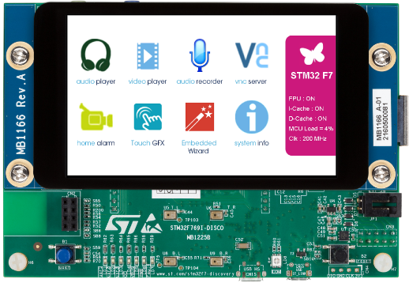
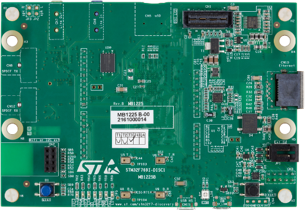
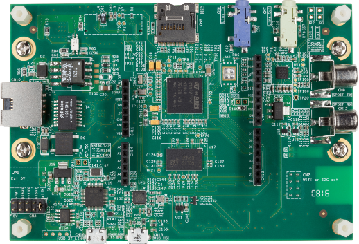
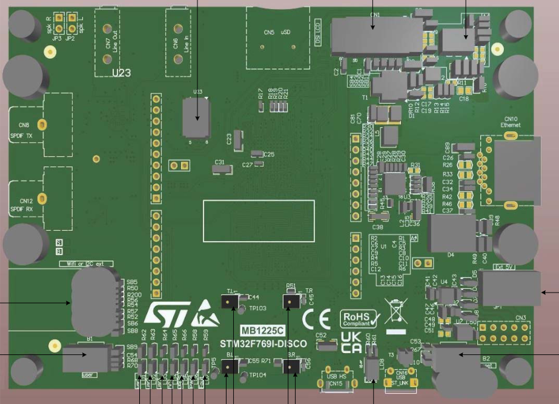
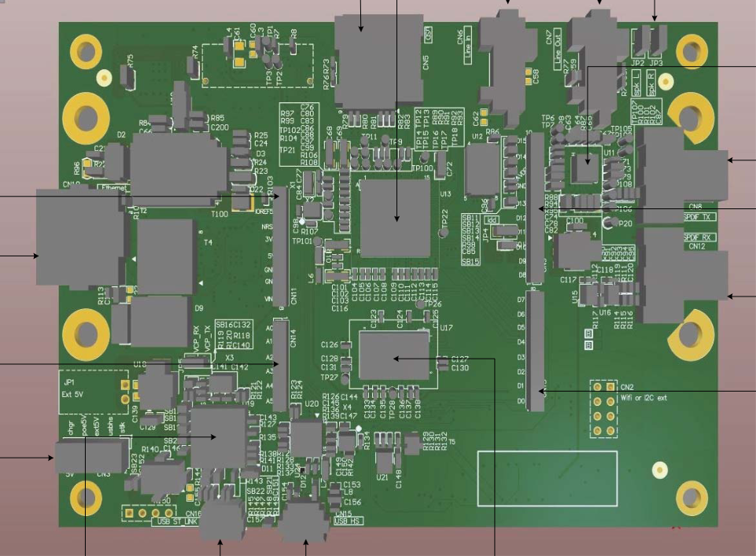

# disco — STM32F769I-Discovery board project

Firmware projects for the **STM32F769I-Discovery** board (STM32F769NI @
216 MHz).








## Board (hardware)

* MCU: STM32F769NI (BGA216, 2 MB flash, 512 KB SRAM, 216 MHz max, dual FPU).
* HSE: 25 MHz external crystal.
* LEDs (all **high active**, `GPIO_PIN_SET` = ON):
  * **LD1** on **PJ13** (green)
  * **LD2** on **PJ5** (red)
  * **LD3** on **PA12** (green)
* USART1 console: PA9 (TX) / PA10 (RX), AF7, 115200 8-N-1 → the on-board
  **ST-Link V2 VCOM** (`COMxx`).
* Debug probe: on-board **ST-Link V2 (SWD)** — same probe also provides the VCP
  console, no external hardware needed.

## Clock configuration (216 MHz)

```
HSE 25 MHz → PLL (M=25, N=432, P=2) → SYSCLK 216 MHz
  AHB /1  → HCLK 216 MHz
  APB1 /4 → 54 MHz
  APB2 /2 → 108 MHz
  OverDrive on, VOS scale 1, flash latency 7
```

Copied verbatim from the vendor 216 MHz template (the STM32Cube_FW_F7 package).

## Projects

| Project          | What it is                                     |
| ---------------- | ---------------------------------------------- |
| `blink_hello`    | 3-LED blink + UART freq print + ADC internal channels |
| `dhry_216m`      | Dhrystone 2.1 benchmark @ 216 MHz              |
| `coremark_216m`  | CoreMark 1.0 @ 216 MHz                         |
| `qspi_flash_test`| MX25L51245G QSPI flash erase/program/read benchmark |
| `sdram_test`     | on-board SDRAM write/read/memcpy benchmark     |
| `lcd_touch_test` | MIPI DSI LCD (OTM8009A) + FT6206 touch demo    |

Each project folder contains its own README with build/flash instructions and
the measured benchmark results.

## Build & flash

Each project has `build.sh` (GNU arm-none-eabi-gcc, the default) and supports
a separate `build-ac6/` dir for Keil AC6 (armclang). The build outputs the
`.elf` + `.hex`; `ninja flash` programs the board via probe-rs + the on-board
ST-Link V2, and `ninja dfu-flash` via USB DFU (fallback):

```bash
cd app/blink_hello
bash build.sh
ninja flash        # probe-rs download --chip STM32F769NI via ST-Link V2 (SWD)
ninja dfu-flash    # USB DFU via STM32CubeProgrammer (needs BOOT0=1 + reset)
```

Then open the USART1 console at 115200 8-N-1 (the ST-Link V2's virtual COM
port — `COMxx`, the number varies per machine).

> `ninja flash` auto-detects the connected probe (a single ST-Link V2). To pin
> a specific probe, view its selector with `probe-rs list` (e.g.
> `0483:374b:xxxx...` for an ST-Link V2 — every unit has its own serial) and
> pass `-DDEBUG_PROBE=<selector>` at configure time.

## Reference material

* The `main-stm32f769i-disco` folder of the local board database: user manual
  (UM2033), schematics (MB1166 / MB1225), programming manual (PM0253) and
  reference manual (RM0410).
* The `STM32F769I-Discovery` BSP under the STM32Cube_FW_F7 package
  (`Drivers/BSP/STM32F769I-Discovery`).
